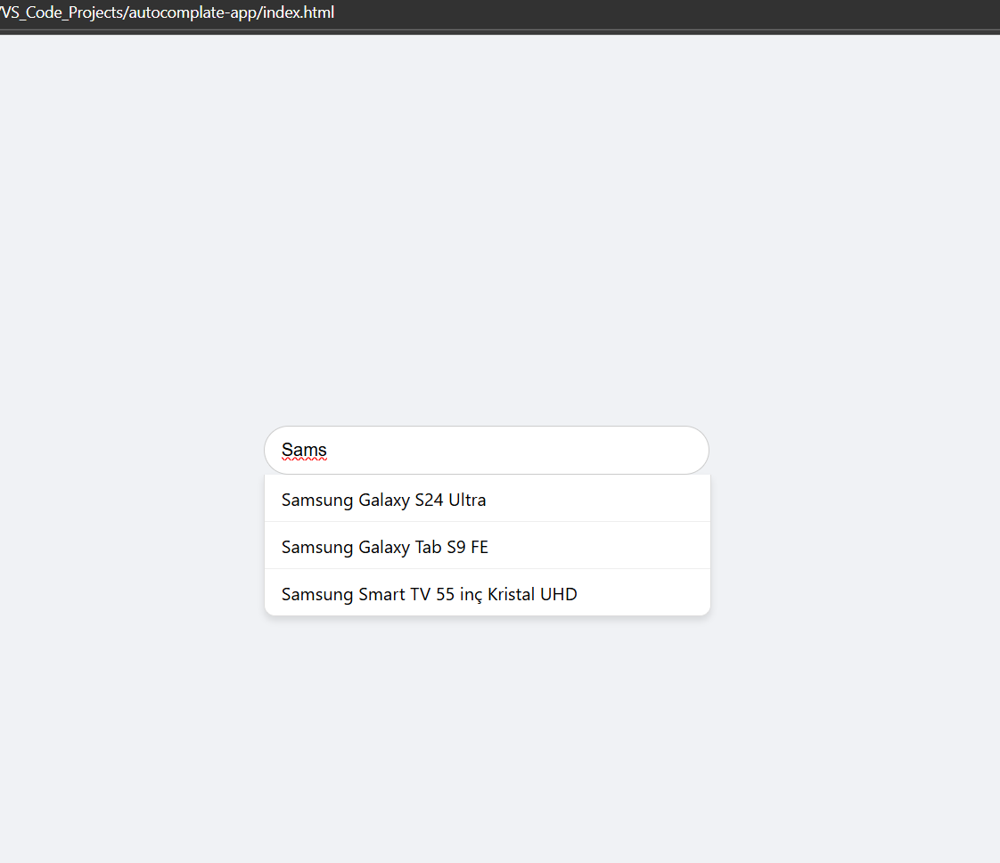
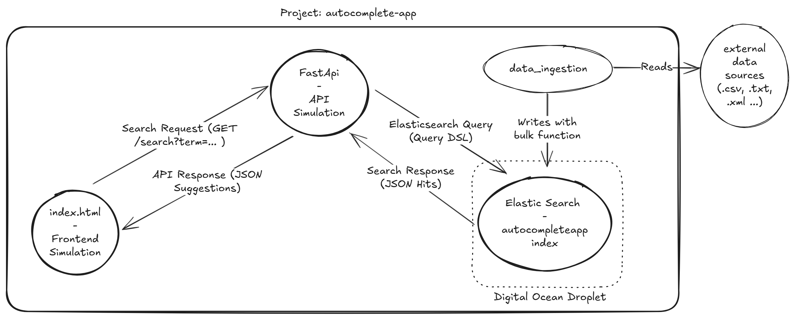
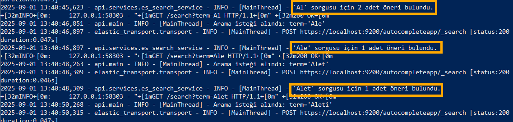
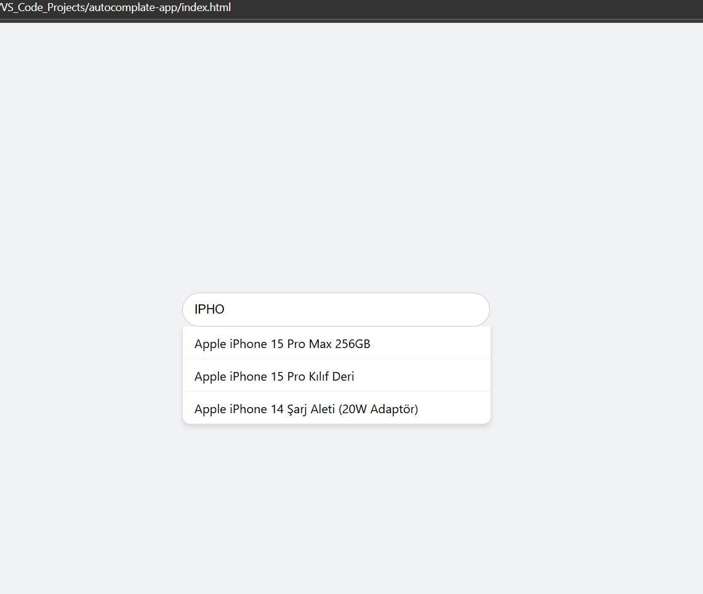
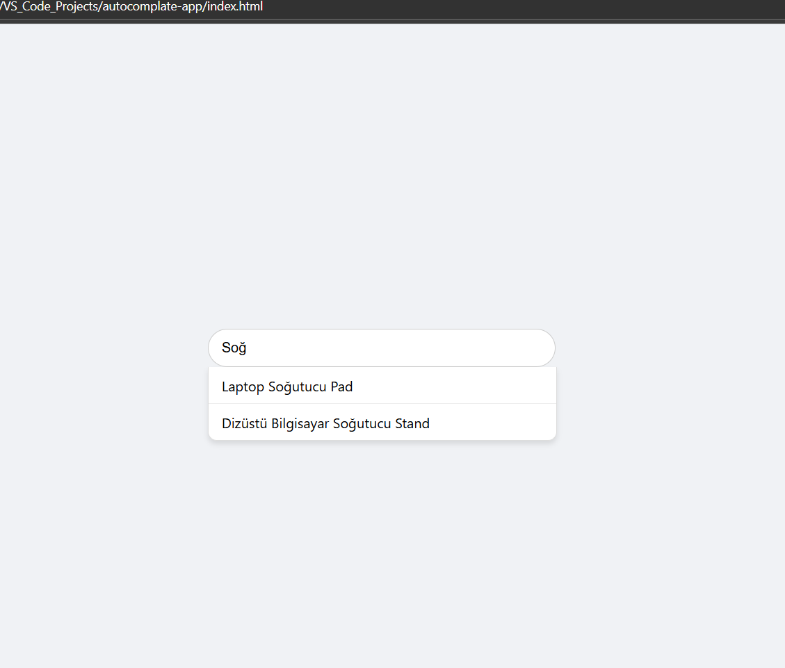

# Gerçek Zamanlı Autocomplete (Yazdıkça Arama) API Projesi 

*Bu proje, modern bir e-ticaret veya arama platformu için, kullanıcının yazdığı her harfeye anında yanıt veren, bir "autocomplete" (otomatik tamamlama) servisini, Elasticsearch ve FastAPI kullanarak nasıl inşa edileceğini gösteren, bir veri mühendisliği projesidir.*

-----

## 1\. Projenin Amacı ve İş Problemi

Modern web uygulamalarında, kullanıcıların aradıkları ürünü veya bilgiyi anında bulabilmeleri, kullanıcı deneyimini (UX) ve dolayısıyla ticari başarıyı doğrudan etkiler. Bu projenin amacı, bir arama kutusuna yazılan ilk birkaç harften yola çıkarak, en alakalı ürün veya içerik önerilerini milisaniyeler içinde sunan, **sağlam (robust)** ve **ölçeklenebilir (scalable)** bir arka plan (backend) servisi oluşturmaktır.

## 2\. Sistem Mimarisi ve Veri Akışı

Proje, üç ana bileşen üzerine kurulmuştur: Veri Yükleme, API Servisi ve Arama Motoru.

1.  **Veri Yükleme (Data Ingestion - Çevrimdışı İşlem):**

      * Harici kaynaklardan (`.csv`, `.txt` vb.) gelen ürün verileri, `data_ingestion` adındaki Python script'i ile okunur.
      * Bu script, verileri Elasticsearch'ün `_bulk` API'sini kullanarak, autocomplete için özel olarak yapılandırılmış `autocompleteapp` indeksine verimli bir şekilde yazar.

2.  **Canlı Sorgulama (Live Querying):**

      * **`Frontend Simulation (index.html)`**: Kullanıcının arama yaptığı basit web arayüzü, yazdığı her karakteri bir arama isteğine (`Search Request`) dönüştürür.
      * **`FastAPI - API Simulation`**: Gelen isteği alır ve Elasticsearch'ün anlayacağı bir JSON sorgusuna (`Elasticsearch Query DSL`) çevirir.
      * **`Elasticsearch - autocompleteapp index with autocomplete feature`**: Bu sorguyu, `edge_ngram` analizörü sayesinde önceden hazırlanmış olan indeks üzerinde milisaniyeler içinde çalıştırır ve eşleşen sonuçları (`Search Response`) API'ye döndürür.
      * **`FastAPI`**: Elasticsearch'ten gelen sonucu, frontend'in anlayacağı temiz bir JSON formatına (`API Response`) dönüştürerek tarayıcıya gönderir.
      * **`Frontend`**: Gelen öneri listesini, arama kutusunun altında dinamik olarak gösterir.

## 3\. Kullanılan Teknolojiler

  * **Arama Motoru ve Analiz:** Elasticsearch 8.x
  * **Veri Görselleştirme ve Yönetim:** Kibana 8.x (Dev Tools)
  * **API Servisi:** Python, FastAPI, Pydantic, Uvicorn
  * **Veri Yükleme (ETL):** Python, `elasticsearch-py` (resmi istemci)
  * **Altyapı:** DigitalOcean Droplet (Ubuntu)
  * **Geliştirme ve Güvenlik:** Git & GitHub, `venv`, `utils/logger.py`, **SSH Tüneli**

## 4\. Proje Çıktıları ve Testler

Geliştirilen sistem, kullanıcının yazdığı ön eklere (prefix) göre anlık ve alakalı öneriler sunar. API'nin her bir tuş vuruşuna nasıl tepki verdiği, aşağıdaki loglarda görülebilir. Kullanıcı "Al" -\> "Ale" -\> "Alet" yazdıkça, API sürekli yeni sorgular gönderir ve güncel önerileri alır.

#### **Test Örnekleri**

Kibana Dev Tools üzerinden yapılan testler, `match_phrase_prefix` gibi sorguların `edge_ngram` ile indekslenmiş veri üzerinde ne kadar hızlı ve doğru çalıştığını doğrulamaktadır.

## 5\. Best Practice ve Profesyonel Yaklaşımlar

  * **Özel Metin Analizi:** Projenin kalbi, Elasticsearch'te tanımlanan özel `analyzer`'dır. `edge_ngram` token filtresi kullanılarak, ürün adları indeksleme anında tüm olası ön eklerine bölünür. Bu, "yazdıkça arama" işlevselliği için en verimli ve en modern yaklaşımdır.
  * **Modüler ve Test Edilebilir Kod:** Proje, sorumluluklarına göre `api`, `data_ingestion`, `configs` ve `utils` gibi ayrı modüllere bölünmüştür. Bu, kodun okunabilirliğini, bakımını ve test edilebilirliğini artırır.
  * **Asenkron API:** FastAPI'nin asenkron yapısı, API'nin aynı anda çok sayıda arama isteğine, sistemi yavaşlatmadan cevap vermesini sağlayarak **ölçeklenebilir** bir altyapı sunar.
  * **Veri Doğrulama:** FastAPI ile entegre çalışan `Pydantic` modelleri, hem API'ye gelen isteklerin hem de API'den dönen yanıtların veri yapısını güvence altına alarak sistemi daha **sağlam (robust)** hale getirir.
  * **Güvenli Altyapı:** Sunucudaki tüm servislere (Elasticsearch, Kibana) dış ağdan erişim güvenlik duvarı (`ufw`) ile kapatılmış, tüm geliştirme ve yönetim işlemleri güvenli bir **SSH Tüneli** üzerinden sağlanmıştır.